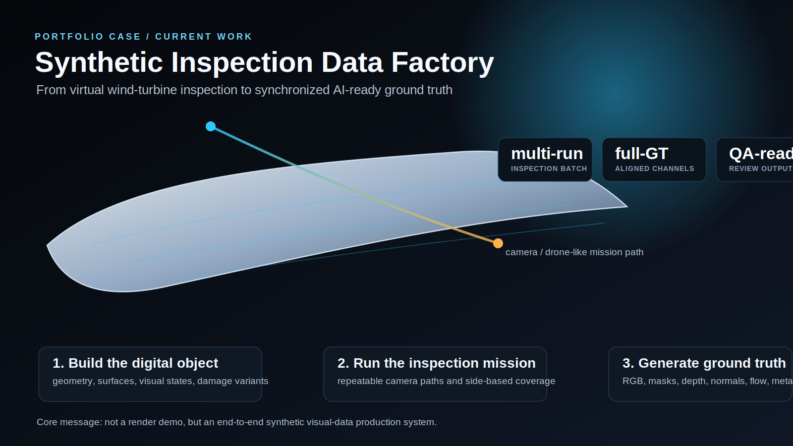
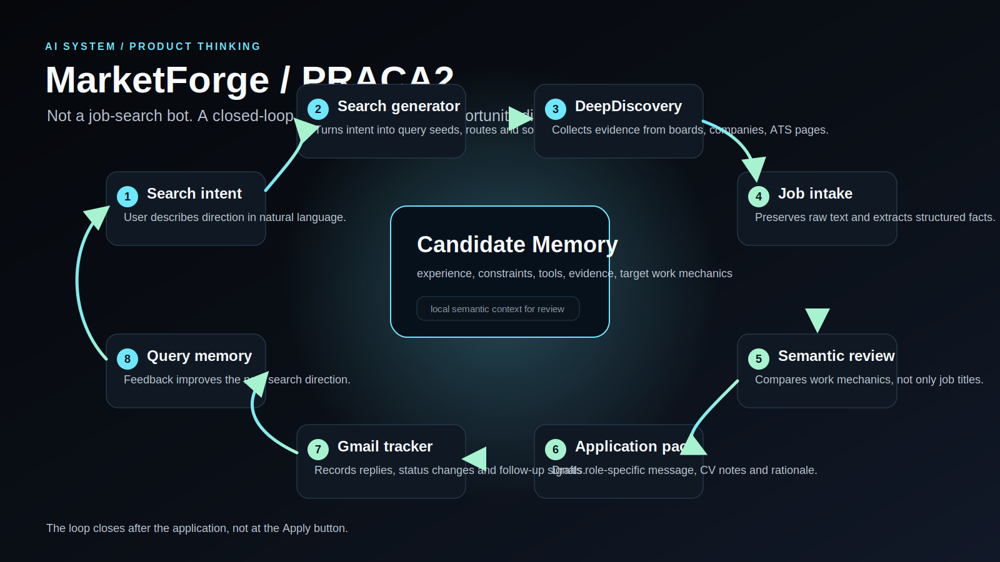

# Dzianis Rytus Portfolio

Portfolio repository for selected work across AI, synthetic visual data, 3D simulation, rendering, architecture, spatial design and technical product systems.

The central direction is **visual intelligence systems**: building scenes, data, interfaces and explanations that connect technical structure with strong visual clarity.

## Featured Case Studies

### 1. Synthetic Inspection Data Factory

[Open case study](cases/synthetic-inspection-pipeline.md)



A public, non-confidential portfolio explanation of an end-to-end synthetic visual-data pipeline for AI-based wind-turbine blade inspection.

Core pattern:

```text
digital object -> inspection mission -> generated data -> ground-truth channels -> review / QA
```

This case shows work at the intersection of 3D simulation, rendering, synthetic data, computer vision outputs, spatial reasoning and dataset-quality review.

### 2. MarketForge / PRACA2 — AI Opportunity Discovery System

[Open case study](cases/marketforge-ai-system.md)



A personal AI discovery and decision-support system for finding, reviewing and tracking professional opportunities by work-mechanics similarity rather than simple job titles.

Core pattern:

```text
intent -> search strategy -> raw evidence -> candidate memory -> semantic review -> application -> feedback
```

This case shows AI product thinking: modular pipeline design, evidence-first ingestion, candidate memory, local semantic review, human-in-the-loop decisions and closed-loop tracking.

## Portfolio Map

| Area | Case Study | Purpose |
| --- | --- | --- |
| Synthetic Data / Computer Vision | [Synthetic Inspection Pipeline](cases/synthetic-inspection-pipeline.md) | Show an end-to-end 3D-to-ground-truth workflow without exposing confidential work data. |
| AI Systems / Product Thinking | [MarketForge / PRACA2](cases/marketforge-ai-system.md) | Show search architecture, evidence preservation, local AI workflows and product reasoning. |
| 3D / Rendering / Technical Art | [3D Rendering and Visual Systems](cases/3d-rendering-visual-systems.md) | Show materials, environments, visual realism and game/real-time-adjacent direction. |
| Architecture / Spatial Design | [Architecture and Concept Design](cases/architecture-concept-design.md) | Show spatial thinking, composition, technical architecture background and large-scale visual projects. |
| Scientific / Biomedical AI | [Scientific and Biomedical AI](cases/scientific-biomedical-ai.md) | Show academic AI, EEG thesis direction, biotechnology background and scientific communication. |

## Core Direction

I work at the intersection of:

- synthetic 3D data generation for computer vision
- 3D simulation and rendering pipelines
- technical art, materials and environments
- AI systems and automation tools
- architecture, spatial design and visual storytelling
- scientific and biomedical AI

The common thread is the ability to turn complex spatial, visual or technical problems into structured systems that can be generated, inspected, explained and improved.

## Confidentiality Policy

Some real work is connected to university or laboratory projects and cannot be published directly. Public case studies in this repository use one of these forms:

- public self-created demo assets
- simplified reproductions of workflow mechanics
- high-level diagrams without internal parameters
- sanitized screenshots or visuals only when explicitly approved
- original portfolio text written specifically for public use

See [docs/confidentiality.md](docs/confidentiality.md).

## Planned Portfolio Form

This repository may later power a personal website. The site should stay minimal, visual and focused:

```text
landing page
-> selected case studies
-> visual gallery
-> technical notes
-> CV / contact links
```

The target style is monumental sci-fi minimalism: high whitespace, strong typography, few but powerful visuals and a clear sense of scale.

## Status

This repository is being built into a public portfolio. The first priority is to make the two strongest systems understandable immediately: the synthetic inspection data pipeline and MarketForge / PRACA2.
