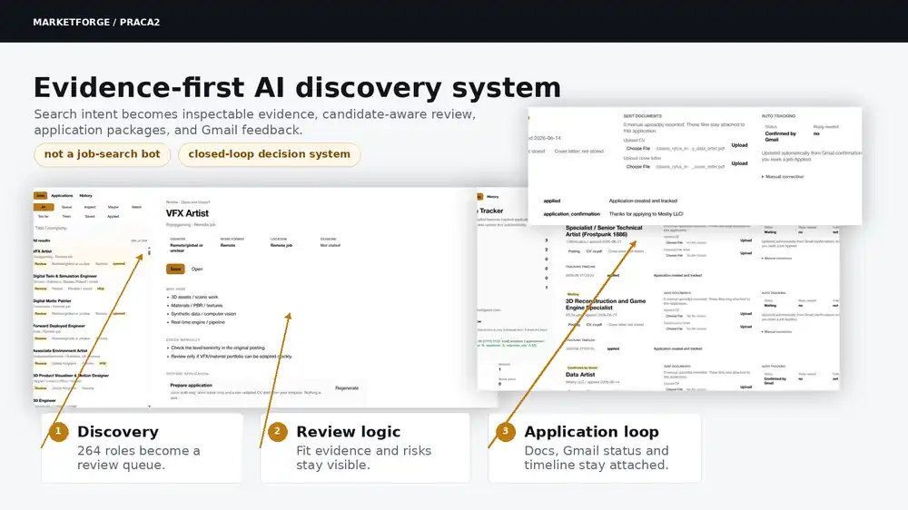
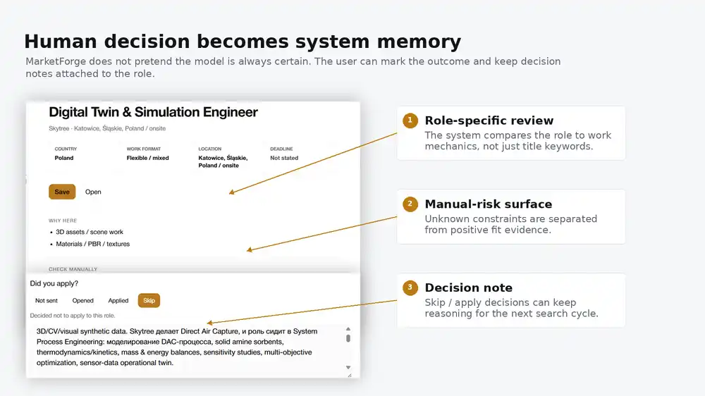
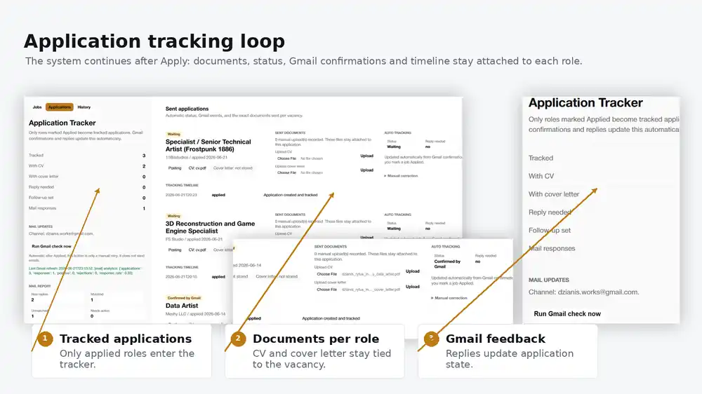

# MarketForge / PRACA2 — AI Opportunity Discovery System








## What This Is

**MarketForge is an evidence-first AI system for discovering, reviewing and tracking professional opportunities by work-mechanics similarity, not just by job titles.**

It is not a job-search bot. It is a closed-loop decision system:

```text
search intent
↓
source discovery
↓
raw evidence
↓
candidate-aware review
↓
human decision
↓
application package
↓
Gmail feedback
↓
better next search
```

## What The Real Screens Show

| Screen | What it proves |
| --- | --- |
| Job review workspace | A large opportunity set becomes an inspectable queue, with each role opened, classified and reviewed. |
| Why Here / Check Manually | The system separates positive fit evidence from unknowns and manual-risk checks. |
| Digital Twin review | Matching is based on work mechanics: 3D assets, materials, simulation, visual data and pipeline similarity. |
| Decision note | Apply / skip / save decisions can preserve the user's reasoning instead of disappearing after one click. |
| Application tracker | Applied roles become tracked applications with status, documents, mail state and follow-up state. |
| Application detail | Gmail confirmations, sent documents and timeline events stay attached to the exact vacancy. |

## Product Logic

MarketForge handles the whole loop, not only the search result:

1. **Discovery**

   The system collects opportunities from multiple directions and reduces them into a reviewable queue.

2. **Candidate-aware review**

   Each role is checked against the candidate's real work pattern, not only against title keywords.

3. **Visible uncertainty**

   The system does not pretend to know everything. Missing information becomes a manual-check item.

4. **Human decision memory**

   The user can apply, skip, save or watch a role, while keeping the reasoning attached to the opportunity.

5. **Application intelligence**

   Prepared documents, application state, Gmail confirmations and replies become part of the same record.

## Why It Matters

Classic job search breaks when the target profile is interdisciplinary. A role can be relevant because of the actual work mechanics even when the title looks different.

MarketForge is built around that deeper pattern:

```text
real work mechanics
↓
source evidence
↓
candidate context
↓
practical decision
```

For my own profile, this means searching around synthetic visual data, 3D simulation, rendering pipelines, computer-vision-ready datasets, digital twins, technical art and spatial AI product work.

## Core System Layers

| Layer | Role |
| --- | --- |
| Search Brief Builder | Converts a vague search direction into structured search intent. |
| Search Generator | Builds query strategy, source routes and retrieval plans. |
| DeepDiscovery | Finds and preserves source evidence from job boards, company pages, ATS pages and manual sources. |
| Job Intake | Stores raw text first, extracts factual metadata and prepares semantic chunks. |
| Candidate Memory | Holds structured candidate context, capabilities, evidence, tools and constraints. |
| Semantic Review | Explains fit, flags uncertainty and prepares the user for a decision. |
| Application Tracker | Connects documents, status, Gmail events, timeline and follow-up state. |

## Design Principles

- preserve raw source evidence before interpretation
- rank by work-mechanics similarity, not only by title or industry
- keep uncertainty visible instead of inventing fake match percentages
- treat missing information as a manual-check flag
- keep the user in the decision loop
- continue tracking after the application is sent

## Transferable Product Pattern

The same logic is relevant beyond job search. MarketForge demonstrates how I think about AI products where the system must preserve evidence, compare alternatives and support decisions in domains such as architecture, real estate, digital twins, spatial planning, research discovery and technical recruiting.

## Public Scope

This public case uses sanitized product screenshots. It does not include private email contents, API keys, private candidate profile files or personal application records.