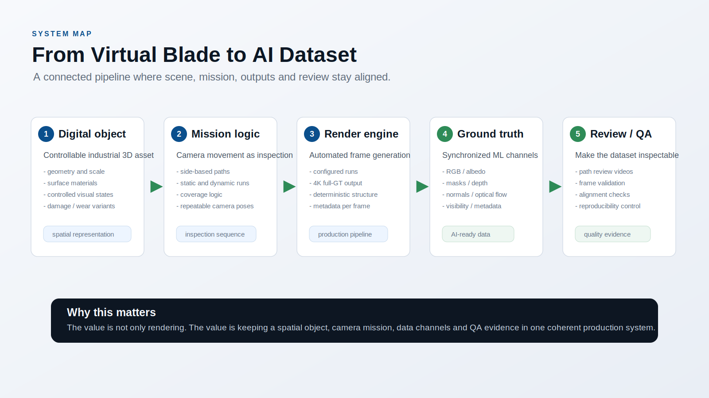
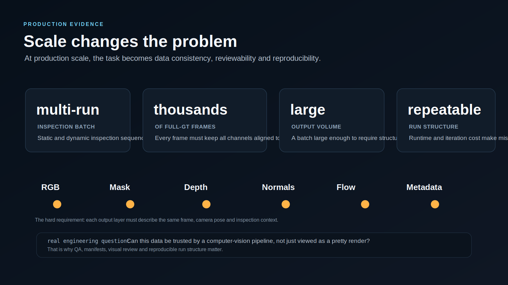

# Synthetic Inspection Data Factory


## One-Sentence Summary

A full-stack synthetic visual-data pipeline that turns a virtual wind-turbine inspection mission into synchronized computer-vision-ready ground truth.

This is not a single 3D render or a decorative Blender scene. The important part is the system: digital object, inspection mission, rendering automation, aligned ground-truth outputs, review videos, manifests and QA.

## 30-Second Scan

- **Domain:** synthetic 3D data, computer vision, inspection, 3D simulation, rendering.
- **Core pattern:** spatial object -> controlled mission -> generated dataset -> QA evidence.
- **Output:** not only RGB frames, but aligned masks, depth, normals, optical-flow-style motion data, visibility overlays and metadata.
- **Scale:** production-style multi-run batches with thousands of full-ground-truth frames and large structured outputs.
- **Why it matters:** the work proves system thinking across visual realism, spatial logic, automation and dataset quality.

## Problem

Inspection datasets are hard to collect and annotate. Real-world wind-turbine blade data is expensive, limited by access, lighting, weather, safety, rarity of defects and manual labeling cost.

Synthetic data helps when the task needs controlled visual conditions, exact ground truth, repeatable camera motion, rare cases, systematic coverage or fast iteration before real-world validation.

The hard part is not rendering a nice image. The hard part is keeping the whole production chain consistent:

```text
3D object -> camera mission -> rendered frame -> ground-truth channels -> metadata -> review / QA
```

## System Map



| Layer | What it does | Why it matters |
| --- | --- | --- |
| Digital object | Builds a controllable blade-like inspection object with geometry, material state and visual surface variation. | The visual domain can be changed deliberately instead of waiting for rare real-world cases. |
| Mission logic | Simulates camera/drone-style inspection routes along blade sides and surface-following paths. | The dataset is generated from repeatable inspection logic, not random screenshots. |
| Render automation | Produces repeatable full-ground-truth frame sequences through structured runs. | The workflow scales beyond manual image creation. |
| Ground truth | Exports synchronized computer-vision channels for the same camera frame. | Each frame becomes machine-learning-ready evidence. |
| Review and QA | Checks coverage, path behavior, output alignment, manifests and review videos. | The result can be inspected as a dataset, not just viewed as an image. |

## Production-Style Evidence



At production scale, the real engineering problem becomes consistency. Every RGB frame, segmentation mask, depth map, normal map, optical-flow output, visibility overlay and metadata record has to describe the same frame, pose and inspection context.

The useful question is not only:

```text
Does the render look plausible?
```

The stronger question is:

```text
Can this output be trusted by a computer-vision pipeline?
```

That is why QA, manifests, visual review and reproducible run structure matter.

## My Role

My role sits between 3D visual production, synthetic data generation and technical QA.

I work on:

- preparing digital-twin-style 3D inspection environments
- working with large industrial geometry and surface-material workflows
- realistic surface detail, wear and controlled visual variation
- camera / drone-like inspection path planning and review
- generation of structured visual outputs for computer vision
- debugging render artifacts, camera-motion issues and output alignment problems
- communicating the pipeline clearly for technical and non-technical audiences

My background in architecture and 3D visualization is relevant here because the work requires spatial reasoning, surface readability, visual judgment, material realism and system-level thinking.

## What This Proves

- I can think about visual systems as data-production systems, not only as images.
- I understand the link between 3D representation, camera logic and computer-vision outputs.
- I can work with a pipeline where visual quality, automation, QA and reproducibility all matter at once.
- I can explain a complex technical workflow in a way that is understandable to product, design and engineering people.

## Transfer to AI Product Work

The transferable pattern is:

```text
real-world spatial problem
-> structured digital representation
-> controlled simulation or generation
-> evidence / metrics / alternatives
-> review
-> better decision
```

That is close to the logic behind useful AI tools for architecture, retail layout, real estate, digital twins, industrial inspection and other spatial decision-support systems.

## Public Scope

This case study is a public, non-confidential representation. It does not contain internal laboratory data, private project files, unpublished datasets, original production configs, private code or project-specific parameters.

The visuals are public portfolio illustrations created to communicate the pipeline mechanics at a high level.
